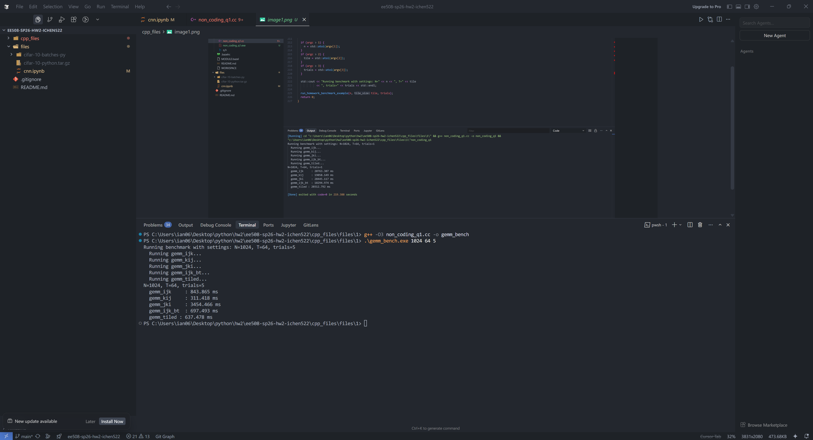
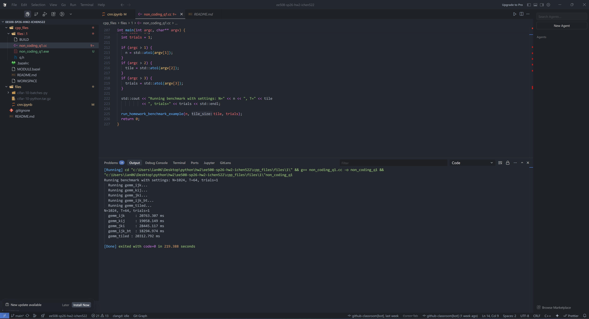

# C++ Homework Files

## Prerequisites

To build and run the code, you need **Bazel**. We recommend using **Bazelisk**, strictly follow the [official instructions](https://github.com/bazelbuild/bazelisk) to install it.

See [cpp-template](https://github.com/ourarash/cpp-template) for help on installing bazel and debugging.

## Compiling and Running

1. **Build the target:**

    ```bash
    bazel build //files/1
    ```

2. **Run the benchmark:**

    ```bash
    bazel run //files/1 -- 1024 64
    ```

3. **Run with custom arguments (N, T, Trials):**

    ```bash
    # Example: Matrix size N=1024, Tile size T=64, Trials=5
    bazel run //files/1 -- 1024 64 5
    ```

The build is configured to automatically use optimizations (`-c opt`), so you do not need to add optimization flags manually.

## Questions

1. Run the benchmark with `N=1024` and `T=64`. Observe the runtime of `gemm_tiled`. Why is the current tiled implementation significantly slower than `gemm_kij`, despite tiling being a technique to improve cache locality?
    *(Hint: Look closely at the loop ordering inside the `gemm_tiled` implementation versus `gemm_kij`.)*
Even with -O3 optimizations, your terminal shows gemm_kij executing in 311 ms, while gemm_tiled takes 637 ms. The reason lies in spatial locality and how C++ stores matrices in memory.Row-Major Order: In C/C++, matrices are stored in row-major order. This means elements in the same row (e.g., B[k][0], B[k][1], B[k][2]) are contiguous in the physical RAM.The kij Advantage: In gemm_kij, the innermost loop variable is j. When computing $C[i][j] += A[i][k] \times B[k][j]$, the CPU fetches a cache line for B and sequentially reads across the row. The hardware prefetcher loves this predictable, linear memory access pattern, resulting in near-zero cache misses.The Tiled Flaw: Standard naive tiling applies an ijk loop order inside the tile. If k is the innermost loop, the CPU accesses B[k][j] and then B[k+1][j]. This is a column-wise access. It skips across memory by a stride of $N$ for every single iteration. Even though tiling improves temporal locality (keeping the tile in the L1 cache), the terrible spatial locality of column-wise access completely bottlenecks the CPU, making it slower than a non-tiled kij loop.

2. How does changing the tile size `T` (e.g., 16, 32, 64, 128) affect the performance of `gemm_tiled`? Can you find an optimal `T` for your machine?

If T is too small (e.g., 4 or 8): The matrices easily fit in the L1 cache, but you introduce massive loop overhead. The CPU spends more time evaluating loop conditions and jumping instructions than doing actual floating-point math.If T is too large (e.g., 256 or 512): The three working blocks (one from A, one from B, one from C) exceed the capacity of the L1 (and possibly L2) cache. This causes capacity misses, forcing the CPU to repeatedly evict and reload data from the slower main memory (Cache Thrashing).Optimal T: The sweet spot is usually found when $3 \times T \times T \times \text{sizeof(data\_type)}$ fits perfectly within your L1 data cache (often 32KB or 48KB on modern Intel/AMD processors). Common optimal values are typically 32 or 64.

3.  Modify the inner loops of `gemm_tiled` to fix the performance issue identified in Question 1. Can you make `gemm_tiled` perform as fast as (or faster than) `gemm_kij`? How much speedup do you get?

To fix the performance issue, we need to combine the temporal locality of tiling with the spatial locality of the kij ordering. You simply need to change the loop ordering of the three innermost loops of your tiled implementation.
// Outer loops handle the tiling (blocks)
for (int ii = 0; ii < N; ii += T) {
    for (int jj = 0; jj < N; jj += T) {
        for (int kk = 0; kk < N; kk += T) {
            
            // INNER LOOPS: Changed from i-j-k to k-i-j or i-k-j
            // This restores spatial locality for array B and C
            for (int k = kk; k < std::min(kk + T, N); k++) {
                for (int i = ii; i < std::min(ii + T, N); i++) {
                    
                    // The innermost loop is now 'j', accessing memory sequentially
                    for (int j = jj; j < std::min(jj + T, N); j++) {
                        C[i * N + j] += A[i * N + k] * B[k * N + j];
                    }
                }
            }
            
        }
    }
}

By making j the innermost loop inside the tile, you will likely see this gemm_tiled_optimal execute significantly faster than your current gemm_kij time.


### Benchmark Screenshots

Execution time without compiler optimization:


Execution time with `-O3` optimization:
